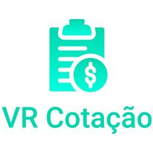

<p align="center">
   
   <p align="center">
        Website para cotação de preço de produtos com fornecedores
        <br>
        <a href="https://hub.docker.com/repository/docker/vrsoftbr/cotacao">DockerHub</a>
        ·
        <a href="http://wiki.vrsoft.com.br/wiki/index.php/Manual_do_Sistema_VR_Cotacao_Web">Wiki</a>
   </p>

</p>

## VR Cotação Web

### Configuração dos Ambientes

- Crie um arquivo `.env` na pasta raíz com base no `.env.example` para configurar o envio de e-mails pela funcionalidade **Esqueci a senha**.

#### Desenvolvimento

- Executar o comando abaixo em um terminal, estando no mesmo diretório do arquivo `docker-compose.yml`:

  ```
  docker-compose up --build
  ```

  A senha padrão para desbloquear o arquivo .xlsx exportado pela aplicação é:

  ```
  vrc0t4c40
  ```

#### Produção

- Com o docker e docker-compose já instalados, baixar o arquivo `docker-compose.prod.yml` no ambiente do cliente;
- Editar o arquivo `docker-compose.prod.yml`, alterando os enviroments de acordo com o seu banco de dados e loja.
- Executar o comendo `docker-compose -f docker-compose.prod.yml up --build` estando no mesmo diretório do arquivo `docker-compose.prod.yml`

##### Observações

- Quando estiver em desenvolvimento e precisar usar junto com o VRMaster, pode-se utilizar as configurações de produção localmente.

- O link apontado no `.env` deve ser o link da raíz do site que o cliente disponibiliza para os fornecedores, sem `/` no final. Exemplo:
`http://123456.sn.mynetname.net/cotacao`

- Caso tenha problemas relacionados as dependências instaladas do projeto, basta deletar a pasta `vendors` e buildar a imagem novamente ou usar os comandos de docker-compose com a flag de `--build`.

### Construido com

- [PHP 5.4](https://www.php.net/releases/5_4_0.php)
- [Bootstrap 2.2.2](https://bootstrapdocs.com/v2.2.2/docs/)
- [Composer](https://getcomposer.org/)
